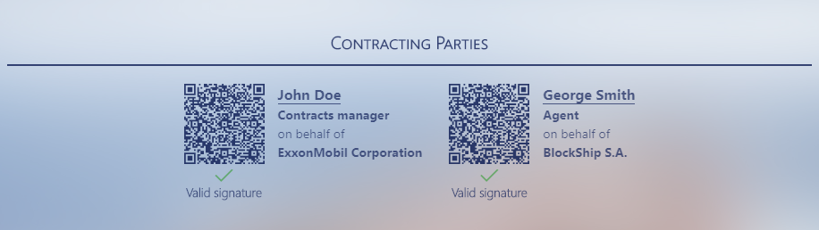

  

Thalassa is a conceptual experimental service aiming to demonstrate how the marine industry could be electronically unified. Given that technology rules everything and that no aspect of business life would be considered without a “pinch” of bytes, this idea is a good opportunity to plan a digital maritime world where shipowners, charterers, shipbrokers, agents, insurers, attorneys, jurists, financial institutions, state authorities, the vessels themselves, pilots, technology experts and so forth can transform maritime business into an unprecedented “realm” of efficiency and safety. This is what the name of this service points out. In Greek mythology, Thalassa was the primeval spirit of the sea. The name denotes exactly this: it is a connotation, something that covers everything, a unified service whereby any maritime factor can be electronically accelerated. Its implementation is far beyond the notion of “challenge”; everything in this idea is based on concepts that during its development are at an embryonic state and nothing can prognosticate the viability of such an initiative. However, by providing a premature implementation of the scopes and the features of this service, anyone could be stimulated to go over a crucial question: How can technology facilitate people with means of overcoming physical and procedural barriers by preserving the leading role of humans? But wait. What does this mean?

## What-Why-Legal engineering

The shipping sector is one of the best examples where such initiatives could be implemented, since its practical implications are extremely important. With a service monitoring maritime voyages (note that smart ships are on the way), applying cryptography to proof itself against cyberattacks and automating everything, life is undoubtedly easier. But we forget something: where are humans? And this is the point where Thalassa takes action.

For a ship to carry something, we need an agreement. Anything subsequent is the result of this agreement. By involving technology and generalizing, we would think like this: what about an agreement, a charterparty for example, that humans conclude and technology executes? But let’s take a further step: what about an agreement that humans create based on their specific needs for the specific purpose and technology executes? Here is the real “marriage” of law and technology.

  

In the picture above you can see a conceptual approach of such a marriage. It contains a part of an electronic contract. In the upper-right side there is the hash of this contract (along with its timestamp in UTC time), which is also the hash of the block where the contract is stored. So, in this case, the block is the contract. Below this there is the “Contracting Parties” section. If we expand it, we will see the hashes of the contracting parties’ signatures along with their information, just like in the picture below (an example of what a real contracting parties section would look like):

  

After this, we see the “Essential Elements” section. By expanding it, we can review all the essential information agreed by the parties for the execution of the contract (the full implementation of this section will arrive in the future). Generally, a block can contain everything, not just contracts (for example, this contract could be only a part of the block). But the interesting part is the clauses. Moving on to the Clauses section any by examining the off-hire clause (altered clause of the original found [here](http://www.hfw.com/downloads/HFW-Cyber-Pack-July-2016.pdf) (page 5), you can see a warning message (umm, something is going on, but what?) and a subsection with the clause in readable format and another subsection right to it entitled “***Legen***”, whereas this section contains the same clause as in the readable format section but this time with some weird symbols. What is that? Well, let’s think about it: every contract contains keywords or context that makes sense, that is, it introduces rules. In light of this, all the relevant context that makes sense in this particular clause has been included in double dollar symbols. There symbols denote that their content can be transformed into executable code. So, do we have to do with a smart contract? A ricardian contract? Something else? In fact, we have a hybrid. In this very premature electronic charterparty, the off-hire clause (except for the second paragraph) is both readable by humans and machines. Now, let’s “decode” the inner symbols’ meanings:

| **Identifier** | **Description** |
| :--- | :--- |
| **@** | Event-Consequence (here it’s the loss of time, namely we care if time is lost during the voyage).|
| **@<** | A cause of the event (here such a cause is the deficiency and/or breakdown of systems, hull, machinery and equipment). |
| **@.systems(breakdown)** | The specific object/event related with cause. The dot here means complement something and the word in the parenthesis denotes the word to be complemented (no space must exist between them, because spaces denote total entities and here it is something different). So, this results in the systems’ breakdown. |
| **@<(~)** | Another cause, but this time undefined. The tilde symbol in the parenthesis means exactly what is described in the clause: *any other cause*. Here, due to the fact that this description is very general, more complex code needs to be implemented to define what other “cause means”; even the legal world may argue about the facts encompassed by this meaning. |
| **=>** | The rule to take action when its requirements have been met. Here, the consequence is that the hire will cease (the verb is the main consequence and the noun in the parenthesis denoted what will be affected by the verb). |
| **==** |Refers to the parenthesis of the agreed rule and it is its complement. Here, the rule is “cease” and == says *what* will cease (the hire). |
| ** | Adds an additional parameter to the rule specified. It means that the rule will be executed with this condition. Here, the parameter is the time lost, that is, the hire will cease only for the time lost because of the delay. |
| **time.** | A word followed by a dot (not at the beginning, like causes, as described above) means that this word will be complemented by another context and that the whole context relates to the rule. So, here this context refers to the ** context. |

The main scope of this *Legen* (legal engineering) syntax is to execute code based on the circumstances. The code to be executed depends on *keywords*, namely the words inside the symbols (the symbols could be named *identifiers*). In our example, “loss of time” and “grounding” are keywords. In a production environment, the decision whether there is indeed loss of time would depend on the ship’s sensors along with specific code. For example, if grounding is detected, then the system can call a specific part of code. This code can calculate the difference between the estimated time of arrival of the ship and the time passed since grounding. This difference could constitute loss of time. With this difference, the code can cease the payment of hire automatically (along, of course, with notification of the parties).

To demonstrate such a case, in our example an “Enable clause” button is added below the clause. If you click it, it will call a method containing specific keywords along with their identifiers. By combining the loss of time (a randomly generated number of days), a message is returned and appended under the clause’s title to notify that the payment of hire has ceased. For demonstration purposes, each time you click the button, the message will differ. Of course, in a production environment, this button would be absent and the clause would be automatically enabled by the ship’s sensors. Also, the code would not only notify but also stop paying the hire.

This is only an extremely small sample of what could be achieved with these ideas. Possibilities are infinite and for such services, like Thalassa, to see the light of day, huge libraries of clauses, frameworks and relevant code would have to be created, either by organizations or any other entity, to ensure the feasibility of these services. The symbols described above are non-exhaustive; new identifiers and keywords can be invented.  Legal wording is complex, and so the relevant code will be. Remember, we do not deal just with smart or ricardian contracts, but with complete legal instruments, fully enforceable, as such are largely recognized until now.

And, voilà, the profession of legal engineer (see [here](https://blog.highq.com/enterprise-collaboration/the-rise-of-the-legal-engineer)) has just been born! Such professionals have to be creative. When combining clauses with code, the rules must be defined in a way ensuring that machines operate effectively but simultaneously that humans still can express their intentions freely, without being bound by the “algorithmic” way of thinking. In such a context, the code must be implemented where execution and rules take place, rather than areas with little machine importance. In other words, we are not forced to transform every single part of the contract into code. For example, code is of uttermost interest when the contract itself automatically and remotely navigates the ship. There, a whole system and network of sensors, GPS utilities and complex programs could be created, and all these will operate under the commands of the contract. Remember: without an agreement, nothing can happen. If something is detected that falls into the contract’s wordings, only the parties’ intentions and rules can determine what’s on next. And this is the value of legal engineers, since, by combining law and technology, they can draft electronic contracts fully adapted to the parties’ needs ensuring that they will be automatically executed. This means that each time a contract is prepared, its code may vary, because its rules may vary. Or, for saving time, libraries can be created providing us with standard electronic contracts, so parties will alter only their essential elements, such as the vessel’s name, the cargo to be carried and loading-discharging dates. Take Congenbill (see [here](https://www.letterofcredit.biz/index.php/2018/12/01/what-is-congenbill-bill-of-lading/) and [here](https://shipsforsale.su/upload/materials/1612291440061056.pdf)) for example: its clauses are preprinted. The same could happen with electronic contracts.

## How it works

For a smooth user experience, Thalassa has been built as a single-page application. This means that there are no page reloads or interruptions, whereas errors are handled with push notifications that point to the error messages. Also, it relies on blockchain technology, which is implied in the service’s logo: a spiral referring to a wave but also to the infinite sequence of blocks created. It utilizes an ArangoDB database, where everything is encrypted using public key cryptography. When someone registers (for now, only two types of users are defined: legal engineers and shipbrokers plus an administrator), the system generates a unique keypair only for the specific user. The private key must be always kept secret, just like cryptocurrencies, and it is the only credential required for login (by camera scanning of the QR code generated during registration or by copying-pasting the private key). There is no username or password.

For the time being, the only functionality found in Thalassa (along with an administrator’s dashboard for validating the service’s blockchain) is the demonstration of a charterparty’s part including rules transformed into code. In a real production environment, Thalassa would be much more: a whole system managing shipping industry’s activities, to put it simply, everything from concluding electronic contracts and navigating ships to paying taxes, insurance and auto loading and discharging cargoes. So, in addition to contracts, the database can contain everything.

Upon the conclusion of a new contract (to be subsequently implemented - relevant code is found in ContractService class), a unique secret key is generated and encrypted with the parties’ public keys. The encrypted secret key is stored in each party’s section of the database in the form of key-pair values (the key is the index of the block where the contract has been saved and the value is the encrypted secret key). To view the contract, the system uses the parties’ private keys to decrypt the secret key, which will be finally used to decrypt the contract. The choice of generating secret keys is deliberate: due to the fact that a contract is a binding agreement and not a personal message, there may be more than one party involved. If the classic public key cryptography methods were used, the contract would be encrypted with only one public key, preventing all other parties from viewing it, something unwanted. Also, were the contract directly encrypted with public keys, it would be stored in the database as many times as the public keys involving, consuming valuable space. With the choice of secret key, the contract is stored only once.

Regarding privacy rules, like GDPR, speculation is complicated. Due to the established right to be forgotten, the service’s blockchain is simple for now, without implementing schemes like Merkle trees, because all data stored may sometime be deleted, and until balance between blockchain’s security and the right to delete the data is achieved, the database structure must be kept simple. Here we have an obvious contradiction: in general, blockchain’s data is immutable, but rules say that this data must be deleted upon request or after a specific period of time. This issue is under speculation and in the future a relevant implementation will arrive, e.g. by forming not one but smaller blockchains that group elements of common interest (for example, different blockchains for contracts and ships’ routes), which can be deleted after a specific period of time or upon request.

## Usage

Thalassa is available in two versions, ASP.NET Core MVC and Spring Boot. To use it, you need an IDE and [ArangoDB](https://www.arangodb.com/download-major) installed.

For demo purposes, during initialization of the service, two users are automatically created, a legal engineer and an administrator. To use the service, you can login by using private key “d0b2df0582f262e50dccc9f3586ded1d0560ff4b46db82806a74b2493e9b92ad” for legal engineer and “f628a227cbd50ad8d7f88b39b7ed544d9fc9032bc77fd8160a2018abab4d3531” for administrator. You can also create your own demo accounts, but further functionality for new accounts has not been implemented yet.

Note for Spring Boot version: Because Thalassa uses Libsodium (in addition to Bouncy Castle) for encryption-decryption, its libraries have been included in the project. If during compilation these libraries are found corrupt or inappropriate for your system, you need to define and use different libraries in the Initializer class (Thalassa/Configuration/Initializer.java) by following the instructions [here](https://github.com/muquit/libsodium-jna#load-the-libsodium-c-library-first) and [here](https://libsodium.gitbook.io/doc/installation).

## Known issues

During login and because Thalassa uses camera scanning of the private key (in QR code form), if the user logs in before camera is fully initialized (e.g. when user quickly pastes the private key and logins), the camera may still be on even after login. In this case, click the service’s logo in the upper-left corner or the dropdown menu next to it (navbar) and the camera will be disabled. This issue is under investigation.

In ASP.NET Core MVC version, due to some problems with ASP.NET Core’s validation system, you will face some user experience distraction during register and login. For example, the input fields will instantly bounce during typing for first time. Also, during login, if you just paste the private key, the login button will not appear. In this case, you have to input some characters first, delete them and then paste the private key to make the button appear. These issues are under investigation.

# © 2019 jdouv Some rights reserved
## Copyright notice

The project in this repository utilizes third party software and sources, as described in the next paragraph. Apart from all these, the specific implementation of the ideas and initiatives described above, including the name “Thalassa” when refering to an electronic service unifying the marine industry, the spiral of the logo, the “Legen” syntax, the structure of this web application (code files and the database’s structure related to importing and exporting data relevant to the scope of this service), the elements’ position and the way they appear, are intellectual property rights of jdouv, hereby declared.

You may obtain copies of this project **strictly** provided that you refer to the aforementioned copyright notice along with a link to this repository.

#### Third-party software:
* Cryptography: [Bouncy Castle](https://www.bouncycastle.org/) and [Libsodium](https://libsodium.gitbook.io/doc/)
* QR code generator: [QR Code generator](https://github.com/nayuki/QR-Code-generator)
* QR code camera scanning: [Instascan](https://github.com/schmich/instascan)
* Background image: [Tanker at sea](https://wpblink.com/wallpaper-525076)
* Other third-party software (such as Gradle plugins) subject to the relevant terms of use.
